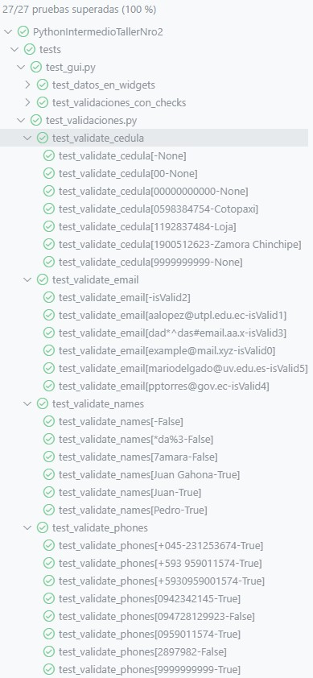

# Taller Nro. 2 - Segundo Bimestre

Estimado estudiante lea detenidamente el problema. Para completar la entrega genere un documento PDF con capturas de funcionamiento y el código más importante de la aplicación. Como respaldo de la solución, comprima todo el proyecto en un archivo zip y suba por separado a CANVAS. Éxitos.

## PROBLEMA

Genere una aplicación GUI que permita ingresar al usuario la siguiente información

Nombre  
Apellido  
Correo  
Número de teléfono celular  
Número de cédula

Si la información proporcionada es correcta obtener:

- De qué sitio es la persona
- Indicar si utiliza o no un correo educativo.

Realizar pruebas unitarias para validar el funcionamiento de la información solicitada, para facilitar la validación utilice expresiones regulares.

**Número de cédula:** El número de cédula es único en Ecuador y está compuesto por 10 dígitos. Los dos primeros dígitos del número de identidad representan la provincia en donde fue emitida dicha cédula.

## Recursos adicionales

### Comprobación de Test Unitarios

